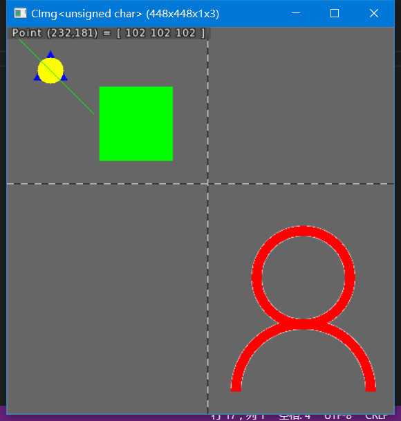
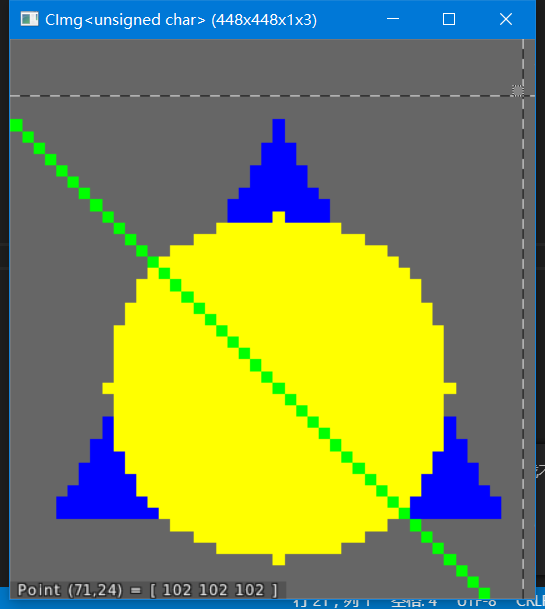
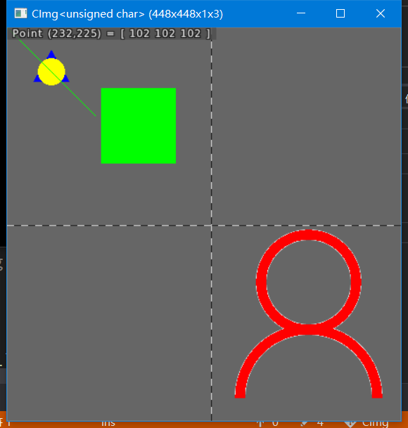
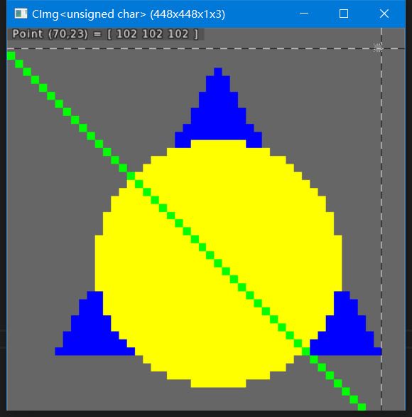

# 第一次作业报告

17343116 吴国璋

## 实验环境

Visual Studio 2019

Windows 10 14393

CImg 2.7.0

## 实验结果

不使用 CImg 的作图方法，效果如图：

放大后结果如图：

使用 CImg 的作图方法，效果如图：

放大后结果如图：

从中可见，使用 CImg 的作图方法之后，圆显得更像圆，而作者“原创”的画圆方法则随着半径减小将更像圆角矩形。在作者“原创”的方法中，对圆内各点进行计算，仅当该点距离圆心小于或等于半径时，才画上黄色。这样使得图上出现锯齿现象。作图时，对图形边缘做出适当处理可以使效果更好。